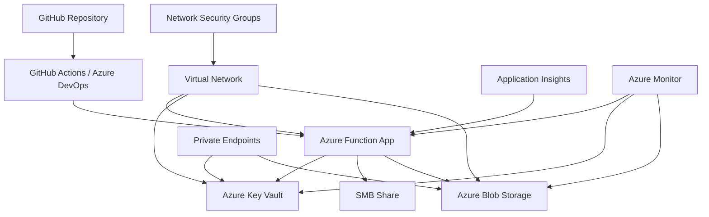

# FunctionCopy - Modernized Azure Log Processor

[](https://github.com/corsec00/FunctionCopy/actions)
[](https://sonarcloud.io/dashboard?id=corsec00_FunctionCopy)
[](https://codecov.io/gh/corsec00/FunctionCopy)
[](https://opensource.org/licenses/MIT)

## Header
Autor: Leo Santos
Data da última verificação: 12/Ago/25

## Visão Geral

O FunctionCopy é uma solução modernizada de processamento de logs que utiliza Azure Functions para automatizar a coleta, filtragem e armazenamento de arquivos de log de compartilhamentos de rede. Esta versão implementa as melhores práticas de segurança, incluindo Azure Key Vault para gerenciamento de credenciais, CI/CD automatizado e arquitetura de segurança robusta. Este projeto surgiu de uma demanda corporativa juntamente com a necessidade de criação de exercícios para as aulas de Segurança em Cloud. 

### Principais Melhorias

- **Segurança Aprimorada**: Credenciais armazenadas no Azure Key Vault com Managed Identity
- **CI/CD Automatizado**: Pipelines GitHub Actions e Azure DevOps para deploy contínuo
- **Arquitetura Segura**: Private Endpoints, VNet Integration e Network Security Groups
- **Monitoramento Avançado**: Application Insights, alertas de segurança e auditoria completa
- **Backup Automatizado**: Rotinas de backup para Key Vault e dados críticos

## Arquitetura



### Componentes Principais

| Componente | Descrição | Função |
|------------|-----------|---------|
| **Azure Function** | Processador principal de logs | Executa a cada 15 minutos, processa arquivos .LOG e .TXT |
| **Azure Key Vault** | Gerenciamento seguro de credenciais | Armazena credenciais SMB e connection strings |
| **Azure Blob Storage** | Armazenamento de logs processados | Container `processed-logs` para arquivos filtrados |
| **Application Insights** | Monitoramento e telemetria | Logs, métricas e alertas de performance |
| **Virtual Network** | Isolamento de rede | Segurança de rede com Private Endpoints |
| **Managed Identity** | Autenticação sem credenciais | Acesso seguro ao Key Vault |

## Funcionalidades

### Processamento de Logs
- Conexão automática ao compartilhamento SMB configurado
- Filtragem de linhas contendo palavras-chave: `login`, `logout`, `fail`
- Upload de arquivos processados para Blob Storage com timestamp
- Remoção segura de arquivos originais após processamento

### Segurança
- Credenciais protegidas no Azure Key Vault
- Comunicação criptografada (TLS 1.2+)
- Isolamento de rede com Private Endpoints
- Auditoria completa de acessos e operações
- Backup automático de configurações críticas

### Monitoramento
- Logs centralizados no Application Insights
- Alertas automáticos para falhas e anomalias
- Métricas de performance e utilização
- Dashboard de monitoramento em tempo real

## Pré-requisitos

### Ferramentas Necessárias
- **Azure CLI** 2.40.0 ou superior
- **Azure Functions Core Tools** 4.0 ou superior
- **PowerShell** 7.0 ou superior (ou PowerShell 5.1 no Windows)
- **Python** 3.9 ou superior
- **Git** para controle de versão

### Permissões Azure
- Contributor na subscription Azure
- Permissões para criar recursos (Resource Groups, Function Apps, Key Vault, etc.)
- Acesso para configurar RBAC e Managed Identity

### Configuração do Ambiente
```bash
# Instalar Azure CLI
curl -sL https://aka.ms/InstallAzureCLIDeb | sudo bash

# Instalar Azure Functions Core Tools
npm install -g azure-functions-core-tools@4 --unsafe-perm true

# Login no Azure
az login

# Configurar subscription padrão
az account set --subscription "sua-subscription-id"
```

## Instalação e Deploy

### Opção 1: Deploy Automático (Recomendado)

```powershell
# Clone o repositório
git clone https://github.com/corsec00/FunctionCopy.git
cd FunctionCopy

# Execute o script de deploy completo
./scripts/deploy-complete.ps1 `
    -SmbServer "servidor-01" `
    -SmbShare "Shared02" `
    -SmbUsername "seu_usuario" `
    -SmbPassword "sua_senha"
```

### Opção 2: Deploy Manual

```powershell
# 1. Criar infraestrutura
./scripts/01-create-infrastructure.ps1 `
    -SubscriptionId "sua-subscription-id" `
    -ResourceGroupName "rg-log-processor" `
    -Location "East US" `
    -StorageAccountName "stlogprocessor$(Get-Random)" `
    -FunctionAppName "func-log-processor-$(Get-Random)" `
    -KeyVaultName "kv-log-processor-$(Get-Random)" `
    -SmbServer "servidor-01" `
    -SmbShare "Shared02" `
    -SmbUsername "seu_usuario" `
    -SmbPassword "sua_senha"

# 2. Deploy da função
./scripts/02-deploy-function.ps1 `
    -FunctionAppName "func-log-processor-xxxx" `
    -ResourceGroupName "rg-log-processor"

# 3. Configurar segurança avançada
./security/configure-security.ps1 `
    -ResourceGroupName "rg-log-processor" `
    -FunctionAppName "func-log-processor-xxxx" `
    -KeyVaultName "kv-log-processor-xxxx" `
    -StorageAccountName "stlogprocessorxxxx"
```

## Configuração de CI/CD

### GitHub Actions

1. **Configurar Secrets no GitHub**:
   ```
   AZURE_CREDENTIALS_DEV: Service Principal para desenvolvimento
   AZURE_CREDENTIALS_PROD: Service Principal para produção
   AZURE_FUNCTIONAPP_NAME_DEV: Nome da Function App de desenvolvimento
   AZURE_FUNCTIONAPP_NAME_PROD: Nome da Function App de produção
   AZURE_FUNCTIONAPP_PUBLISH_PROFILE_DEV: Publish profile de desenvolvimento
   AZURE_FUNCTIONAPP_PUBLISH_PROFILE_PROD: Publish profile de produção
   MS_TEAMS_WEBHOOK_URI: Webhook para notificações (opcional)
   ```

2. **Configurar Environments**:
   - Criar environments `development` e `production` no GitHub
   - Configurar protection rules para produção

### Azure DevOps

1. **Criar Service Connections**:
   - `azure-dev-connection`: Conexão para ambiente de desenvolvimento
   - `azure-prod-connection`: Conexão para ambiente de produção

2. **Configurar Variable Groups**:
   ```
   AZURE_FUNCTIONAPP_NAME_DEV: Nome da Function App de desenvolvimento
   AZURE_FUNCTIONAPP_NAME_PROD: Nome da Function App de produção
   AZURE_RESOURCE_GROUP_DEV: Resource Group de desenvolvimento
   AZURE_RESOURCE_GROUP_PROD: Resource Group de produção
   MS_TEAMS_WEBHOOK_URI: Webhook para notificações (opcional)
   ```

## Monitoramento e Operação

### Application Insights
Acesse o portal Azure e navegue até o Application Insights para:
- Visualizar logs de execução em tempo real
- Monitorar métricas de performance
- Configurar alertas personalizados
- Analisar tendências de uso

### Alertas Configurados
- **Falhas de Autenticação**: Múltiplas tentativas de acesso ao Key Vault
- **Alto Uso de CPU**: Function App com utilização acima de 80%
- **Falhas de Execução**: Erros na função principal
- **Acesso Anômalo**: Padrões de acesso suspeitos

## Estrutura do Projeto

```
FunctionCopy-Modernized/
├── .github/
│   └── workflows/
│       ├── azure-function-deploy.yml
│       └── infrastructure-deploy.yml
├── .azuredevops/
│   └── azure-pipelines.yml
├── LogProcessorFunction/
│   ├── __init__.py
│   └── function.json
├── scripts/
│   ├── 01-create-infrastructure.ps1
│   ├── 02-deploy-function.ps1
│   └── deploy-complete.ps1
├── security/
│   ├── security-policy.md
│   └── configure-security.ps1
├── tests/
│   └── test_function.py
├── .bandit
├── .gitignore
├── host.json
├── local.settings.json
├── requirements.txt
└── README.md
```

## Desenvolvimento Local

### Configuração do Ambiente
```bash
# Criar ambiente virtual
python -m venv venv
source venv/bin/activate  # Linux/Mac
# ou
venv\Scripts\activate     # Windows

# Instalar dependências
pip install -r requirements.txt

# Instalar dependências de desenvolvimento
pip install pytest pytest-cov flake8 black bandit safety
```

### Executar Localmente
```bash
# Configurar local.settings.json com suas credenciais de desenvolvimento
# Executar a função localmente
func start
```

### Testes
```bash
# Executar testes unitários
pytest tests/ -v

# Executar com cobertura
pytest tests/ --cov=LogProcessorFunction --cov-report=html

# Análise de segurança
bandit -r LogProcessorFunction/

# Verificação de vulnerabilidades
safety check
```

## Segurança

### Credenciais
- **NUNCA** commite credenciais no código
- Use apenas Azure Key Vault para armazenar segredos
- Rotacione credenciais regularmente
- Monitore acessos ao Key Vault

### Rede
- Private Endpoints para todos os recursos críticos
- Network Security Groups com regras restritivas
- VNet Integration para isolamento
- TLS 1.2+ obrigatório

### Auditoria
- Logs de todas as operações
- Retenção de 90 dias mínimo
- Alertas para atividades suspeitas
- Backup regular de configurações

## Troubleshooting

### Problemas Comuns

#### Erro de Autenticação no Key Vault
```
Erro: DefaultAzureCredential failed to retrieve a token
```
**Solução**: Verificar se a Managed Identity está habilitada e tem permissões no Key Vault.

#### Falha na Conexão SMB
```
Erro: SMBException - Connection failed
```
**Solução**: Verificar credenciais no Key Vault e conectividade de rede.

#### Deploy Falha no CI/CD
```
Erro: Deployment failed
```
**Solução**: Verificar secrets/variables configurados e permissões do Service Principal.

### Logs e Diagnóstico
```bash
# Visualizar logs da Function App
az functionapp logs tail --name func-log-processor-xxxx --resource-group rg-log-processor

# Verificar status dos recursos
az resource list --resource-group rg-log-processor --output table

# Testar conectividade
az keyvault secret show --vault-name kv-log-processor-xxxx --name smb-server
```

## Contribuição

### Processo de Desenvolvimento
1. Fork o repositório
2. Crie uma branch para sua feature (`git checkout -b feature/nova-funcionalidade`)
3. Commit suas mudanças (`git commit -am 'Adiciona nova funcionalidade'`)
4. Push para a branch (`git push origin feature/nova-funcionalidade`)
5. Abra um Pull Request

### Padrões de Código
- Siga PEP 8 para Python
- Use Black para formatação automática
- Mantenha cobertura de testes acima de 80%
- Execute análise de segurança com Bandit

### Testes Obrigatórios
- Testes unitários para novas funcionalidades
- Testes de integração para mudanças na arquitetura
- Análise de segurança para todas as mudanças
- Validação de performance para otimizações

#### Versão 2.1.0 (Planejada)
- [ ] Implementação de Terraform para Infrastructure as Code
- [ ] Integração com Azure Sentinel para SIEM avançado
- [ ] Implementação de Azure Logic Apps para workflows complexos
- [ ] Suporte para processamento de logs em tempo real
- [ ] Integração com Azure Event Grid
- [ ] Machine Learning para detecção de anomalias
- [ ] API REST para integração com sistemas externos
- [ ] Arquitetura de microserviços completa